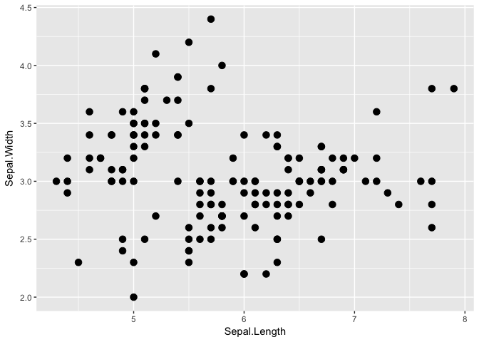
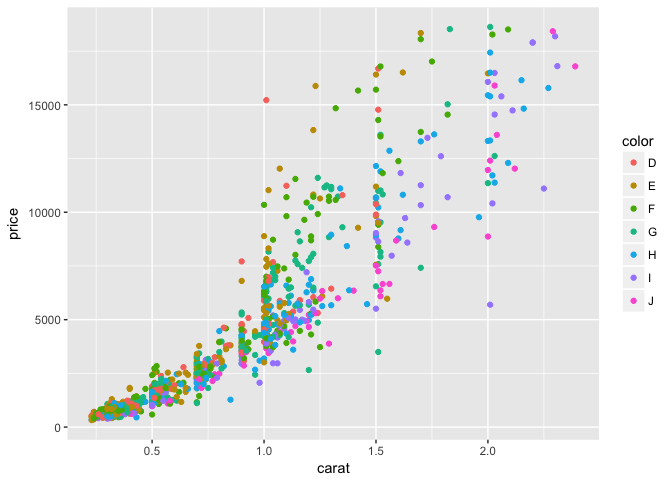
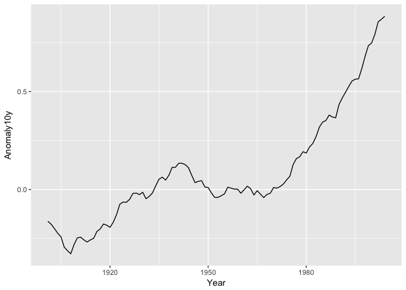
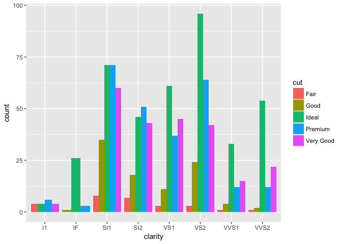
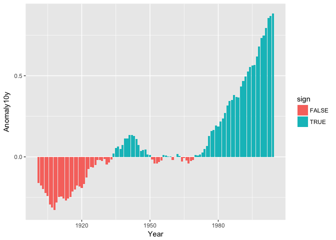
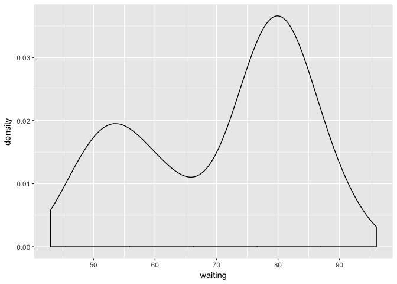
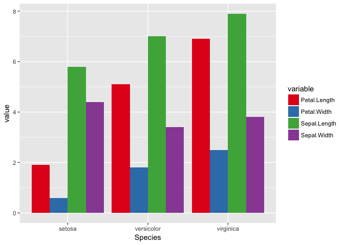
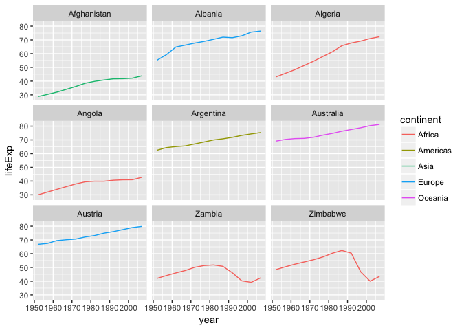
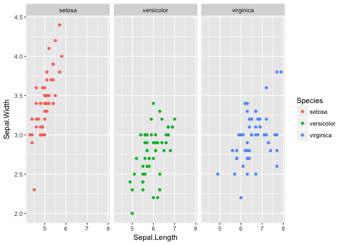
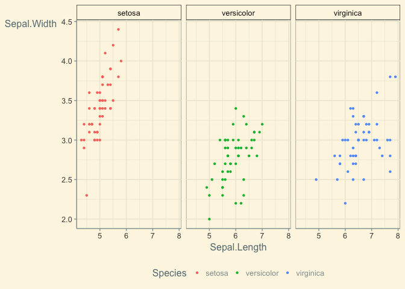

First part of this notebook based on Karthik Ram’s [GGPLOT2
Lecture](https://github.com/karthik/ggplot-lecture) ([CC-By
2.0](https://creativecommons.org/licenses/by/2.0/))

GOALS: Students should be able to use ggplot2 to generate publication
quality graphics and understand and use the basics of the grammar of
graphics.

-   GGPLOT2 developed by Hadley Wickham based on a *grammar-of-graphics*
-   Grammar of graphics consists of a **dataset**, **coordinate
    system**, and **geoms** – the visual representation of data points.
-   Think about figure in layers: like you would in Photoshop,
    illustrator or Inkscape.

DataViz
-------

-   plotting our data is one of the best was to quickly explore it and
    the various relationships between variables
-   3 main plotting systems in R: the base [plotting
    system](http://www.statmethods.net/graphs/), the [lattice
    package](http://www.statmethods.net/advgraphs/trellis.html), and
    [ggplot2](http://www.statmethods.net/advgraphs/ggplot2.html)
    \*`ggplot2` is built on the grammar-of-graphics:
    -   idea that any plot can be expressed from the same set of
        components: a **data** set, a **coodinate system** and a set of
        **geoms**– the visual representation of data points
-   **Key** to understanding `ggplot2` is thinking about a figure in
    layers – think of ArcGIS or programs like Photoshop

Terminology:
------------

-   **ggplot** - The main function where you specify the dataset and
    variables to plot
-   **geoms** - geometric objects
    -   `geom_point()`, `geom bar()`, `geom density()`, `geom line()`,
        `geom area()`
-   **aes** - aesthetics
    -   shape, transparency (alpha), color, fill, line-type.
-   **scales** Define how your data will be plotted
    -   continuous, discrete, log

Think in terms of variable types
--------------------------------


### What are some examples of **continuous variables**? **Categorical variables**? What is it called in R?

Loading Data in R
-----------------

We can load data into R via multiple mechanisms:

### Datasets from base-R and packages

-   Can be part of packages or base-R – these are often set up for
    teaching R or as examples for how to use a package. How do you find
    out what’s there? Use `data()`. More datasets will show after
    package installation and loading.

``` r
data()
```

``` r
#install.packages(openintro)
library(openintro)
```

``` output
Please visit openintro.org for free statistics materials
```

``` output

Attaching package: 'openintro'
```

``` output
The following objects are masked from 'package:datasets':

    cars, trees
```

``` r
data()
```

-   We can load one of these dataframes into our current session by
    using `data()`:

``` r
data(diamonds)
head(diamonds)
```

``` output
  carat       cut color clarity depth table price    x    y    z
1  0.23     Ideal     E     SI2  61.5    55   326 3.95 3.98 2.43
2  0.21   Premium     E     SI1  59.8    61   326 3.89 3.84 2.31
3  0.23      Good     E     VS1  56.9    65   327 4.05 4.07 2.31
4  0.29   Premium     I     VS2  62.4    58   334 4.20 4.23 2.63
5  0.31      Good     J     SI2  63.3    58   335 4.34 4.35 2.75
6  0.24 Very Good     J    VVS2  62.8    57   336 3.94 3.96 2.48
```

``` r
#View(diamonds)
```

-   Note: these are loaded into the R session but aren’t saved as a file
    on our file system.
-   If you want to open one of these as a `csv` you can write it out
    using the `write_csv`

### Reading data from the filesystem and web

``` r
la_circ <- read_csv('data/Public_Library_Monthly_Circulation.csv')
```

``` output
Parsed with column specification:
cols(
  `Sup Dist` = col_integer(),
  `Cost Code` = col_integer(),
  `Library Name` = col_character(),
  City = col_character(),
  `Zip Code` = col_integer(),
  Month = col_character(),
  Year = col_integer(),
  `Month-Year` = col_character(),
  Circulation = col_integer()
)
```

``` r
#la_circ <- read_csv('url')
```

Let’s see what we have:

``` r
la_circ %>% 
  head() %>% 
  kable(
    digits=2,
    caption = "LA County Public Library Monthly Circulation", 
    booktabs = TRUE
  )
```

|  Sup Dist|  Cost Code| Library Name  | City        |  Zip Code| Month    |  Year| Month-Year    |  Circulation|
|---------:|----------:|:--------------|:------------|---------:|:---------|-----:|:--------------|------------:|
|         1|        604| Anthony Quinn | Los Angeles |     90063| January  |  2014| January-2014  |         6246|
|         1|        604| Anthony Quinn | Los Angeles |     90063| February |  2014| February-2014 |         5442|
|         1|        604| Anthony Quinn | Los Angeles |     90063| March    |  2014| March-2014    |         6168|
|         1|        604| Anthony Quinn | Los Angeles |     90063| April    |  2014| April-2014    |         6610|
|         1|        604| Anthony Quinn | Los Angeles |     90063| May      |  2014| May-2014      |         5779|
|         1|        604| Anthony Quinn | Los Angeles |     90063| June     |  2014| June-2014     |         6257|

First Plots with GGPLOT
-----------------------

This famous (Fisher’s or Anderson’s) [iris
data](https://en.wikipedia.org/wiki/Iris_flower_data_set) set gives the
measurements in centimeters of the variables sepal length and width and
petal length and width, respectively, for 50 flowers from each of 3
species of iris. The species are Iris setosa, versicolor, and virginica.

``` r
library(ggplot2)
```

``` output

Attaching package: 'ggplot2'
```

``` output
The following object is masked _by_ '.GlobalEnv':

    diamonds
```

``` output
The following object is masked from 'package:openintro':

    diamonds
```

``` r
data(iris)
head(iris)
```

``` output
  Sepal.Length Sepal.Width Petal.Length Petal.Width Species
1          5.1         3.5          1.4         0.2  setosa
2          4.9         3.0          1.4         0.2  setosa
3          4.7         3.2          1.3         0.2  setosa
4          4.6         3.1          1.5         0.2  setosa
5          5.0         3.6          1.4         0.2  setosa
6          5.4         3.9          1.7         0.4  setosa
```

``` r
ggplot(data = iris, aes(x = Sepal.Length, y = Sepal.Width)) +
  geom_point()
```


**Basic structure**

``` r
ggplot(data = <DATA>) +
  <GEOM_FUNCTION>(mapping = aes(<MAPPINGS>))
```

``` r
ggplot(data = iris, aes(x = Sepal.Length, y = Sepal.Width)) + geom_point()
```


``` r
myplot <- ggplot(data = iris, aes(x = Sepal.Length, y = Sepal.Width))
myplot + geom_point()
```


-   Specify the **data and variables** inside the `ggplot` function.
-   Anything else that goes in here becomes a global setting.
-   Then add layers of geometric objects, statistical models, and
    panels.

**Increase size of points**

``` r
ggplot(data = iris, aes(x = Sepal.Length, y = Sepal.Width)) +
  geom_point(size = 3)
```



**Make it colorful**

``` r
ggplot(iris, aes(Sepal.Length, Sepal.Width, color = Species)) +
  geom_point(size = 3)
```


**Differentiate points by shape**

``` r
ggplot(iris, aes(Sepal.Length, Sepal.Width, color = Species)) +
  geom_point(aes(shape = Species), size = 3)
```


### Exercise 1

``` r
# Make a small sample of the diamonds dataset
d2 <- diamonds[sample(1:dim(diamonds)[1], 1000), ]
```

Then generate this plot below. (open 09-plot-ggplot2-ex-1-1.png)

``` r
ggplot(d2, aes(carat, price, color = color)) + geom_point() + theme_gray()
```



**Switch to Gapminder Data**

``` r
library(readr)  #from tidyverse
#download.file("https://goo.gl/BtBnPg", 'data/gapminder-FiveYearData.csv')
#gapminder <- read.csv("https://goo.gl/BtBnPg")
gapminder <- gapminder::gapminder
```

``` r
ggplot(data = gapminder, aes(x = gdpPercap, y = lifeExp)) +
  geom_point()
```


NOTE:

-   First we call the `ggplot` function -any arguments we provide the
    `ggplot` function are considered **global** options: they apply to
    all layers
-   We passed two arguments to `ggplot`:
    -   data
    -   an `aes` function - which tells ggplot how variables map to
        aesthetic properties
    -   `x` & `y` locations

Alone the ggplot call isn’t enough to render the plot.

``` r
ggplot(data = gapminder, aes(x = lifeExp, y = gdpPercap))
## If run, would produce an error.
```

Need to tell **ggplot** how we want to present variables by specifying a
geom layer. In the above example we used `geom_point` to create a
scatter plot.

``` r
ggplot(data = gapminder, aes(x = lifeExp, y = gdpPercap)) +
  geom_point()
```


### Challenge 1

<http://swcarpentry.github.io/r-novice-gapminder/08-plot-ggplot2#challenge-1>

### Challenge 2

<http://swcarpentry.github.io/r-novice-gapminder/08-plot-ggplot2#challenge-2>

Box plots
---------

See ?geom boxplot for list of options

``` r
library(MASS)
```

``` output

Attaching package: 'MASS'
```

``` output
The following objects are masked from 'package:openintro':

    housing, mammals
```

``` r
head(birthwt)
```

``` output
   low age lwt race smoke ptl ht ui ftv  bwt
85   0  19 182    2     0   0  0  1   0 2523
86   0  33 155    3     0   0  0  0   3 2551
87   0  20 105    1     1   0  0  0   1 2557
88   0  21 108    1     1   0  0  1   2 2594
89   0  18 107    1     1   0  0  1   0 2600
91   0  21 124    3     0   0  0  0   0 2622
```

``` r
ggplot(birthwt, aes(factor(race), bwt)) + geom_boxplot()
```


``` r
ggplot(birthwt, aes(factor(race), bwt)) + geom_boxplot() +
  scale_x_discrete(labels = c("white", "black", "other"))
```


Histograms
----------

See ?geom histogram for list of options

``` r
h <- ggplot(faithful, aes(x = waiting))
h + geom_histogram(binwidth = 30, colour = "black")
```


-   adding color and adjusting the binwidth

``` r
h <- ggplot(faithful, aes(x = waiting))
h + geom_histogram(binwidth = 8, fill = "steelblue", colour = "black")
```


Line plots
----------

**Download data**

``` r
#download.file('https://raw.github.com/karthikram/ggplot-lecture/master/climate.csv', 'data/climate.csv')
#climate <- read.csv(text=RCurl::getURL("https://raw.github.com/karthikram/ggplot-lecture/master/climate.csv"))
```

-   In the climate data set, `Anomaly10y` is a 10-year running average
    of the deviation (in Celsius) from the average 1950–1980
    temperature:

``` r
#climate <- read_csv("data/climate.csv")
climate <- read_csv("https://raw.github.com/karthikram/ggplot-lecture/master/climate.csv")
```

``` error
Warning: Missing column names filled in: 'X1' [1]
```

``` output
Parsed with column specification:
cols(
  X1 = col_integer(),
  Source = col_character(),
  Year = col_integer(),
  Anomaly1y = col_character(),
  Anomaly5y = col_character(),
  Anomaly10y = col_double(),
  Unc10y = col_double()
)
```

``` r
ggplot(climate, aes(Year, Anomaly10y)) +
  geom_line()
```



**We can also plot confidence regions**

-   In the climate data set, `Anomaly10y` is a 10-year running average
    of the deviation (in Celsius) from the average 1950–1980
    temperature, and `Unc10y` is the 95% confidence interval.

> *confidence interval* gives a range of plausible values for a
> parameter. It depends on a specified *confidence level* with higher
> confidence levels corresponding to wider confidence intervals and
> lower confidence levels corresponding to narrower confidence
> intervals. Common confidence levels include 90%, 95%, and 99%.
>
> Usually we don’t just begin chapters with a definition, but
> *confidence intervals* are simple to define and play an important role
> in the sciences and any field that uses data. You can think of a
> confidence interval as playing the role of a net when fishing. Instead
> of just trying to catch a fish with a single spear (estimating an
> unknown parameter by using a single point estimate/statistic), we can
> use a net to try to provide a range of possible locations for the fish
> (use a range of possible values based around our statistic to make a
> plausible guess as to the location of the parameter).

We’ll set `ymax` and `ymin` to Anomaly10y plus or minus Unc10y (Figure
4-25):

``` r
ggplot(climate, aes(Year, Anomaly10y)) +
  geom_ribbon(aes(ymin = Anomaly10y - Unc10y, ymax = Anomaly10y + Unc10y),
              fill = "blue", alpha = .1) +
  geom_line(color = "steelblue")
```


### Exercise 2

Modify the previous plot and change it such that there are three lines
instead of one with a confidence band.

``` r
cplot <- ggplot(climate, aes(Year, Anomaly10y))
cplot <- cplot + geom_line(size = 0.7, color = "black")
cplot <- cplot + geom_line(aes(Year, Anomaly10y + Unc10y), linetype = "dashed", size = 0.7, color = "red")
cplot <- cplot + geom_line(aes(Year, Anomaly10y - Unc10y), linetype = "dashed", size = 0.7, color = "red")
cplot + theme_gray()
```


``` r
#theme_classic
#theme_bw()
#theme_minimal()
```

Gapminder line graph
--------------------

Using scatter plot not the best way to visualize change over time. Let’s
use line plot.

``` r
ggplot(data = gapminder, aes(x=year, y=lifeExp, by=country, color=continent)) +
  geom_line()
```


-   used geom\_line instead of geom\_point
-   added a **by** *aesthetic* to get a line per country and color by
    continent

-   visualize both lines and points on the plot?

``` r
ggplot(data = gapminder, aes(x=year, y=lifeExp, by=country, color=continent)) +
  geom_line() + geom_point()
```


-   note this is layered: so points have been drawn on top of the lines.
-   example of this

``` r
ggplot(data = gapminder, aes(x=year, y=lifeExp, by=country)) +
  geom_line(aes(color=continent)) + geom_point()
```


-   the *aesthetic* mapping of **color** has been moved from the global
    plot options in `ggplot` to the `geom_line` layer so it no longer
    applies to the points

### Challenge 3

<http://swcarpentry.github.io/r-novice-gapminder/08-plot-ggplot2#challenge-3>

Bar Plots
---------

``` r
ggplot(iris, aes(Species, Sepal.Length)) +
  geom_bar(stat = "identity")
```


``` r
library(tidyr)
#df <- melt(iris, id.vars = "Species")
df <- gather(iris, variable, value, -Species )
ggplot(df, aes(Species, value, fill = variable)) +
  geom_bar(stat = "identity")
```


> > The heights of the bars commonly represent one of two things: either
> > a count of cases in each group, or the values in a column of the
> > data frame. By default, geom\_bar uses stat=“bin”. This makes the
> > height of each bar equal to the number of cases in each group, and
> > it is incompatible with mapping values to the y aesthetic. If you
> > want the heights of the bars to represent values in the data, use
> > stat=“identity” and map a value to the y aesthetic.

Dplyr and Tidyr
---------------

*These two packages are the Swiss army knives of R. * dplyr \* filter \*
select \* mutate \* tidyr. \* gather \* spread \* separate

Let’s look at iris again.

``` r
iris[1:2, ]
```

``` output
  Sepal.Length Sepal.Width Petal.Length Petal.Width Species
1          5.1         3.5          1.4         0.2  setosa
2          4.9         3.0          1.4         0.2  setosa
```

``` r
df <- gather(iris, variable, value, -Species ) 
```

``` r
df[1:2, ]
```

``` output
  Species     variable value
1  setosa Sepal.Length   5.1
2  setosa Sepal.Length   4.9
```

``` r
ggplot(df, aes(Species, value, fill = variable)) +
  geom_bar(stat = "identity", position = "dodge")
```


### Exercise 3

Using the d2 dataset you created earlier, generate this plot below. Take
a quick look at the data first to see if it needs to be binned

``` r
d2 <- diamonds[sample(1:dim(diamonds)[1], 1000), ]
ggplot(d2, aes(clarity, fill = cut)) +
  geom_bar(position = "dodge")
```



Exercise 4
----------

-   Using the climate dataset, create a new variable called sign. Make
    it logical (true/false) based on the sign of Anomaly10y.
-   Plot a bar plot and use sign variable as the fill.
-   HINT: Look up `ifelse` function to create `clim$sign`

``` r
clim <- read_csv("https://raw.github.com/karthikram/ggplot-lecture/master/climate.csv")
```

``` error
Warning: Missing column names filled in: 'X1' [1]
```

``` output
Parsed with column specification:
cols(
  X1 = col_integer(),
  Source = col_character(),
  Year = col_integer(),
  Anomaly1y = col_character(),
  Anomaly5y = col_character(),
  Anomaly10y = col_double(),
  Unc10y = col_double()
)
```

``` r
clim$sign <- ifelse(clim$Anomaly10y<0, FALSE, TRUE)
# or as simple as
# clim$sign <- clim$Anomaly10y < 0
ggplot(clim, aes(Year, Anomaly10y)) + geom_bar(stat = "identity", aes(fill = sign)) + theme_gray()
```



Density Plots
-------------

``` r
ggplot(faithful, aes(waiting)) + geom_density()
```



``` r
ggplot(faithful, aes(waiting)) +
  geom_density(fill = "blue", alpha = 0.1)
```


``` r
ggplot(faithful, aes(waiting)) +
  geom_line(stat = "density")
```


Colors
------

``` r
aes(color = variable) 
aes(color = "black")
# Or add it as a scale
scale_fill_manual(values = c("color1", "color2"))
```

``` r
library(RColorBrewer) 
display.brewer.all() 
```


### Using a color brewer palette

``` r
#df  <- melt(iris, id.vars = "Species")
ggplot(df, aes(Species, value, fill = variable)) +
  geom_bar(stat = "identity", position = "dodge") +
  scale_fill_brewer(palette = "Set1")
```



### Manual color scale

``` r
ggplot(iris, aes(Sepal.Length, Sepal.Width, color = Species)) +
  geom_point() +
  facet_grid(Species ~ .) +
  scale_color_manual(values = c("red", "green", "blue"))
```


Transformations and statistics
------------------------------

-   overlay statistical models over the data
-   let’s use our first example

``` r
ggplot(data = gapminder, aes(x = lifeExp, y = gdpPercap, color=continent)) +
  geom_point()
```


-   hard to see relationships b/t points because of strong outliers in
    GDP/cap
-   We can change the scale of units on the `y` axis using the *scale*
    functions
-   These control the mapping between the data values and visual values
    of an aesthetic.
-   We’ll also use the `alpha` function, which is helpful when you have
    a large amount of data which is v. clustered

``` r
ggplot(data = gapminder, aes(x = lifeExp, y = gdpPercap)) +
  geom_point() + scale_y_log10()
```


-   `log10` function applied a transformation to the values of the
    gdpPercap column before rendering them on the plot
    -   each multiple of 10 now only corresponds to an increase in 1 on
        the transformed scale, e.g. a GDP per capita of 1,000 is now 3
        on the y axis, a value of 10,000 corresponds to 4 on the y axis
        and so on
-   This makes it easier to visualize the spread of data on the y-axis.

-   We can fit a simple relationship to the data by adding another
    layer, `geom_smooth`:

``` r
ggplot(data = gapminder, aes(x = lifeExp, y = gdpPercap)) +
  geom_point() + scale_y_log10() + geom_smooth(method="lm")
```


-   make the line thicker by *setting* the **size** aesthetic in the
    `geom_smooth` layer:

``` r
pwd <- ggplot(data = gapminder, aes(x = lifeExp, y = gdpPercap)) +
  geom_point() + scale_y_log10() + geom_smooth(method="lm", size=1.5)
```

-   Two ways an *aesthetic* can be specified:
    1.  Here we *set* the **size** aesthetic by passing it as an
        argument to `geom_smooth`.
    2.  use the `aes` function to define a *mapping* between data
        variables and their visual representation.

### With iris data - smooth

``` r
ggplot(iris, aes(Sepal.Length, Sepal.Width, color = Species)) +
  geom_point(aes(shape = Species), size = 3) +
  geom_smooth(method = "lm")
```


### Within facet

``` r
ggplot(iris, aes(Sepal.Length, Sepal.Width, color = Species)) +
  geom_point(aes(shape = Species), size = 3) +
  geom_smooth(method = "lm") +
  facet_grid(. ~ Species)
```


### Challenge 4a

[http://swcarpentry.github.io/r-novice-gapminder/08-plot-ggplot2\#challenge-3\#challenge-4a](http://swcarpentry.github.io/r-novice-gapminder/08-plot-ggplot2#challenge-3#challenge-4a)

### Challenge 4b

[http://swcarpentry.github.io/r-novice-gapminder/08-plot-ggplot2\#challenge-3\#challenge-4b](http://swcarpentry.github.io/r-novice-gapminder/08-plot-ggplot2#challenge-3#challenge-4b)

Multi-panel figures: FACEting
-----------------------------

-   we can split this out over multiple panels by adding a layer of
    **facet** panels:

``` r
starts.with <- substr(gapminder$country, start = 1, stop = 1)
az.countries <- gapminder[starts.with %in% c("A", "Z"), ]
ggplot(data = az.countries, aes(x = year, y = lifeExp, color=continent)) +
  geom_line() + facet_wrap( ~ country)
```



-   `facet_wrap` layer took a “formula” as its argument, denoted by the
    tilde (~).
-   tells R to draw a panel for each unique value in the country column
    of the gapminder dataset.

Modifying text
--------------

-   would like to add text to elements in the graph
-   do this by adding a few more layers:
    -   **theme** layer controls axis text & text size
    -   **scales** layer to change legend title

``` r
ggplot(data = az.countries, aes(x = year, y = lifeExp, color=continent)) +
  geom_line() + facet_wrap( ~ country) +
  xlab("Year") + ylab("Life expectancy") + ggtitle("Figure 1") +
  scale_colour_discrete(name="Continent") +
  theme(axis.text.x=element_blank(), axis.ticks.x=element_blank())
```


<http://swcarpentry.github.io/r-novice-gapminder/08-plot-ggplot2#challenge-5>

### With iris along coloumns

``` r
#str(iris)
ggplot(iris, aes(Sepal.Length, Sepal.Width, color = Species)) +
  geom_point() +
  facet_grid(Species ~ .)
```


\#\#\# And along rows

``` r
ggplot(iris, aes(Sepal.Length, Sepal.Width, color = Species)) +
  geom_point() +
  facet_grid(. ~ Species)
```



### Or wrap your panels

``` r
ggplot(iris, aes(Sepal.Length, Sepal.Width, color = Species)) +
  geom_point() +
  facet_wrap( ~ Species)
```


Themes
------

Themes are a great way to define custom plots.

`+theme()`

#### see `?theme()` for more options

``` r
ggplot(iris, aes(Sepal.Length, Sepal.Width, color = Species)) +
  geom_point(size = 1.2, shape = 16) +
  facet_wrap( ~ Species) +
  theme(legend.key = element_rect(fill = NA),
  legend.position = "bottom",
  strip.background = element_rect(fill = NA),
  axis.title.y = element_text(angle = 0)) 
```


``` r
#install.packages("ggthemes")
library(ggthemes)
```

Then add one of these themes to your plot
-----------------------------------------

-   `+ theme_stata()`
-   `+ theme_excel()`
-   `+ theme_wsj()`
-   `+ theme_solarized()`

``` r
ggplot(iris, aes(Sepal.Length, Sepal.Width, color = Species)) +
  geom_point(size = 1.2, shape = 16) +
  facet_wrap( ~ Species) +
  theme_solarized() +
  theme(legend.key = element_rect(fill = NA),
        legend.position = "bottom",
        strip.background = element_rect(fill = NA),
        axis.title.y = element_text(angle = 0)) 
```



How to save your plots
----------------------

``` r
ggsave('~/path/to/figure/filename.png')
ggsave(plot1, file = "~/path/to/figure/filename.png")
```

``` r
ggsave(file = "/path/to/figure/filename.png", width = 6,
height =4)
```

``` r
ggsave(file = "/path/to/figure/filename.eps")
ggsave(file = "/path/to/figure/filename.jpg")
ggsave(file = "/path/to/figure/filename.pdf")
```

Resources:
----------

This is just a taste of what you can do with `ggplot2`. RStudio provides
a really useful [cheat
sheet](http://www.rstudio.com/wp-content/uploads/2015/03/ggplot2-cheatsheet.pdf)
of the different layers available, and more extensive documentation is
available on the [ggplot2 website](http://docs.ggplot2.org/current/).
Finally, if you have no idea how to change something, a quick Google
search will usually send you to a relevant question and answer on Stack
Overflow with reusable code to modify!
