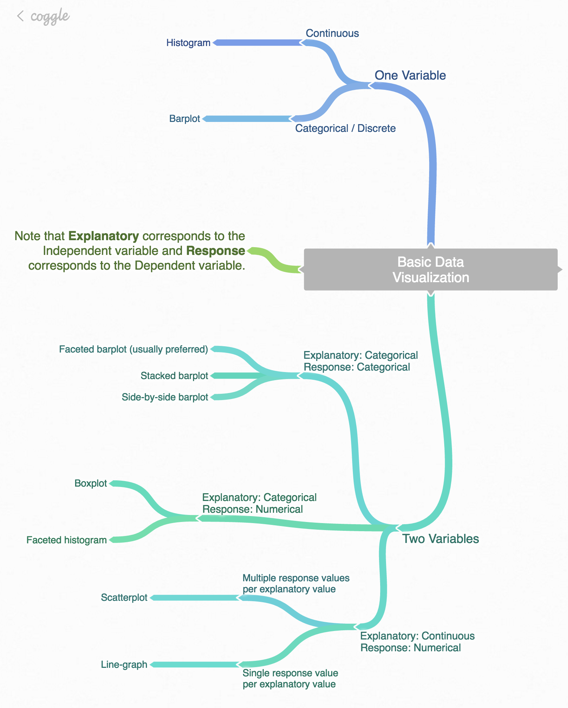

## DataViz

* Plotting our data is one of the best was to quickly explore it and the various relationships between variables
* 3 main plotting systems in R: the base [plotting system](http://www.statmethods.net/graphs/), the [lattice package](http://www.statmethods.net/advgraphs/trellis.html), and [ggplot2](http://www.statmethods.net/advgraphs/ggplot2.html)
*`ggplot2` is built on the grammar-of-graphics:
   * idea that any plot can be expressed from the same set of components: a **data** set, a **coodinate system** and a set of **geoms**-- the visual representation of data points
* **Key** to understanding `ggplot2` is thinking about a figure in layers -- think of ArcGIS or programs like Photoshop where you layer on different information. 

### Needed packages {-}

Let's load all the packages needed for this chapter (this assumes you've already installed them). Read Section \@ref(packages) for information on how to install and load R packages.

```{r message=FALSE}
library(ggplot2)
library(dplyr)
library(lubridate)
library(readr)
```

```{r message=FALSE, warning=FALSE, echo=FALSE}
# Packages needed internally, but not in text.
library(gapminder)
library(knitr)
```


## Some Terminology:

* **ggplot** - The main function where you specify the dataset and variables to plot
* **geoms** - geometric objects
  * `geom_point()`, `geom bar()`, `geom density()`, `geom line()`, `geom area()`
* **aes** - aesthetics 
  * shape, transparency (alpha), color, fill, line-type.
* **scales** Define how your data will be plotted
  * continuous, discrete, log

## Think in terms of variable types



## Five Named Graphs - The 5NG 

For our purposes, we will be limiting consideration to five different types of graphs.  We term these five named graphs the **5NG**:

1. scatterplots (not covering today)
1. linegraphs
1. boxplots ( not today)
1. histograms
1. barplots

* We will discuss some variations of these plots, but with this basic repertoire in your toolbox you can visualize a wide array of different data variable types. 
* Note that certain plots are only appropriate for categorical/logical variables and others only for quantitative variables.
* You'll want to quiz yourself often as we go along on which plot makes sense a given a particular problem or data-set.

### Reading data from the filesystem and web

```{r}
la_circ <- read_csv('data/Public_Library_Monthly_Circulation.csv')
# we can also read from a url
#la_circ <- read_csv('https://github.com/ucla-data-archive/elag2018-shiny/raw/gh-pages/pages/data/Public_Library_Monthly_Circulation.csv')
```

* R likes column or varible names to have no spaces in them, e.g. "Sup Dist". 
* If spaces are encoutnered on read, R will will surround the varible names with a tic **`**. 
* Let's clean this up by renaming the variables. Don't worry about the code below -- it renames the column names in our data set, so they are more usable in R.

```{r}
la_circ <- la_circ %>% 
  rename(sup_dist = "Sup Dist", cost_code = "Cost Code", library_name = "Library Name", city = City, zip_code = "Zip Code", month = Month, year = Year, month_year = "Month-Year", circulation = Circulation)
```

Let's now look at what we have: 

```{r}
la_circ %>% 
  head() %>% 
  kable(
    digits=2,
    caption = "LA County Public Library Monthly Circulation", 
    booktabs = TRUE
  )
```

* We can inspect the data in a few ways: 
  * using `View(la_circ)` will open a tab with the data in RStudio 
  * `glimpse(la_circ)` will output to the console information about the data frame (diminsion, varibles, data types) 
  * `head(la_circ)` and `tail(la_circ)` show us the top and bottom of the dataframe. 
  * `str(la_circ)` an earlier version of `glimpse` 

Each row in this table corresponds to a to the monthly activity for a library in Los Angeles county.  For each row, we have 9 columns:

1. **sup_dist**: Supervisorial District
1. **cost_code**: Internal administrative number.
3. **library_name**	
4. **city**: 	Based on mailing address of the library building. May be unincorporated area of the County.
5. **zip_code**: From the mailing address of the library building.
1. **month** 
1. **year**	
1. **month_year**: Use for chronological sorting.
1. **circulation**: Checkouts and renewals of library books, DVDs, etc. from this library.

## 5NG#3: Histograms

* Let's consider the distribution or spread of circulation counts in the `circulation` variable in `la_circ` data frame. 

### Histograms via geom_histogram 

* A histogram shows how many elements of a single numerical variable fall in specified *bins*.  (by default R will make 30 bins)
* We produce a histogram of the `circulation`:

```{r, warning=TRUE}
ggplot(data = la_circ, mapping = aes(x = circulation)) +
  geom_histogram()
```


```{r}
(max(la_circ$circulation) - min(la_circ$circulation))/30
```

Note here:

* There is only one variable being mapped in `aes()`: the single numerical variable `circulation`. You don't need to compute the y-aesthetic: it gets computed automatically.
* We set the `geom`etric object to be `geom_histogram()`
* A warning corresponds to an urge to specify the number of bins you'd like to create.

### Adjusting the bins {#adjustbins}

We can adjust characteristics of the bins in one of *two* ways:

1. By adjusting the number of bins via the `bins` argument
1. By adjusting the width of the bins via the `binwidth` argument

1. We have the power to specify how many bins we would like to put the data into as an argument in the `geom_histogram()` function. 
1. By default, this is chosen to be 30 somewhat arbitrarily; we have received a warning above our plot that this was done.

```{r}
ggplot(data = la_circ, mapping = aes(x = circulation)) +
  geom_histogram(bins = 60, color = "white")
```

* Note the addition of the `color` argument.  If you'd like to be able to more easily differentiate each of the bins, you can specify the color of the outline as done above. 
* You can also adjust the color of the bars by setting the `fill` argument. Type `colors()` in your console to see all `r length(colors())` available colors.
  
```{r}
ggplot(data = la_circ, mapping = aes(x = circulation)) +
  geom_histogram(bins = 60, color = "white", fill = "steelblue")
```

* Second, instead of specifying the number of bins, we can also specify the width of the bins by using the `binwidth` argument in the `geom_histogram` function. 

```{r binwidth_example}
ggplot(data = la_circ, mapping = aes(x = circulation)) +
  geom_histogram(binwidth = 4000, color = "white", fill = "steelblue")
```

* Exercie: Play around with the binwidth and bins with your neighbor. What do you find? 

## Learning Checks
1. What does changing the number of bins from 30 to 60 tell us about the distribution of temperatures? 

The distribution doesn't change much.

1. Would you classify the distribution of circulations stats as symmetric or skewed?

It is skewed right (determined by direction of tail)

1. What would you guess is the "center" value in this distribution?  Why did you make that choice?

The center is around `r mean(la_circ$circulation, na.rm=TRUE)`. By running the `summary()` command, we see that the median is about 3000 less than the mean, typical of a skewed right variable. 

## Barplots 

Another common task is to present the distribution of a categorical variable. This is a simpler task, focused on how many elements from the data fall into different categories of the categorical variable. Often the best way to visualize these different counts (also known as frequencies) is via a barplot, also known as a barchart.

```{r}
la_circ_jan <- la_circ %>% 
  filter(month == "January")
```


```{r}
ggplot(data = la_circ_jan, mapping = aes(x = sup_dist, y = circulation, fill = factor(year))) +
  geom_col()
```

## Line graph

* They are most frequently used when the x-axis represents time and the y-axis represents some other numerical variable; such plots are known as time series. 
* Time represents a variable that is connected together by each day following the previous day. In other words, time has a natural ordering. 
* Linegraphs should be avoided when there is not a clear sequential ordering to the explanatory variable, i.e. the x-variable or the predictor variable.


```{r}
ggplot(la_circ, aes(x = month_year, y = circulation, by=city)) + geom_line()
```
* The above doesn't render right b/c the `month-year` column doesn't 

```{r}
la_circ$day_month_year <- dmy(paste('01', la_circ$month_year))
```

```{r}
la_circ %>% filter(city == "Los Angeles") %>% 
ggplot(mapping = aes(x = day_month_year, y = circulation, by = library_name, color = library_name)) +
  geom_line()
```

* But what about labels? Can we change? 

```{r}
la_circ %>% filter(city == "Los Angeles") %>% 
ggplot(mapping = aes(x = day_month_year, y = circulation, by = library_name, color = library_name)) +
  geom_line() +
  labs(
    x = "Year",              # x axis title
    y = "Circulation Counts",   # y axis title
    title = "Los Angeles City Libraries Circulation Counts by Month and Year",      # main title of figure
    color = "Library"      # title of legend
  )  + theme(axis.text.x = element_text(face="bold",
                           size=10, angle=45))
```

